<!--START_SECTION:header-->
<div align="center">
  <p align="center">
    
    <h1>🤖 Agentes ADK — Pegada de Carbono & Automação de Tarefas</h1>
    <p>Documentação técnica dos agentes desenvolvidos com Google ADK e Gemini 2.5 Flash</p>
  </p>
</div>
<!--END_SECTION:header-->

<p align="center">
  
  
  
  
</p>

---

## 🌱 Agente 1 — Pegada de Carbono (`agentCoder/`)

Agente orquestrador que guia o usuário no cálculo, compreensão e redução da sua pegada de carbono pessoal.

### Arquitetura

```text
root_agent (orquestrador)
├── search_agent    → busca na web via Google Search
└── coding_agent    → escreve e executa código Python
```

### Fluxo do usuário

| Etapa | Agente responsável | Ação |
|---|---|---|
| Coleta de dados | Carbon Intake | Perguntas empáticas sobre transporte, energia, alimentação |
| Cálculo | Carbon Calculator | Soma emissões e gera baseline em tCO₂e/ano |
| Explicação | Carbon Explainability | Traduz números em linguagem humana com analogias |
| Recomendações | Carbon Advisor | Ações práticas classificadas por impacto × esforço |
| Metas | Carbon Goal | Define metas e acompanha progresso |

### Como executar

```bash
cd src/agent-carbon-footprint
adk web agentCoder
```

---

## ✅ Agente 2 — Tarefas Trello (`agents/agent04/agenttaskmanager/`)

Agente conversacional que gerencia tarefas no Trello via linguagem natural.

### Ferramentas disponíveis

| Ferramenta | Descrição |
|---|---|
| `get_temporal_context` | Retorna data e hora atual |
| `listar_boards` | Lista todos os boards disponíveis |
| `criar_lista` | Cria uma nova lista no board configurado |
| `adicionar_tarefa` | Adiciona card na lista "A Fazer" |
| `listar_tarefas` | Lista tarefas com filtro por status |
| `mudar_status_tarefa` | Move card entre listas |

### Status suportados

| Status | Lista no Trello |
|---|---|
| `a fazer` | A FAZER / TO DO |
| `em andamento` | EM ANDAMENTO / DOING |
| `concluido` | CONCLUÍDO / DONE |

### Como executar

```bash
cd src/agent-carbon-footprint/agents/agent04
adk web agenttaskmanager
```

> Para configurar as credenciais do Trello, consulte o [Guia de Registro no Trello](agents/agent04/readme.md).

---

## 📚 Pré-requisitos

| Habilidade | Nível |
|---|---|
| Python | Intermediário |
| APIs REST | Básico |
| Variáveis de ambiente (`.env`) | Básico |
| Conceitos de agentes de IA | Básico |
| Trello (uso básico) | Básico |

---

## 🛠️ Habilidades exercitadas

- Criação de agentes com `Agent` e orquestração com `AgentTool`
- Uso de ferramentas nativas: `google_search`, `BuiltInCodeExecutor`
- Integração com API do Trello via `py-trello`
- Gerenciamento de credenciais com `.env`
- Separação de responsabilidades entre agentes especializados

---

## 💬 Exemplo de Uso — Agente Trello em Ação

Vamos ver um fluxo completo de gerenciamento de tarefas, desde um board vazio até a alteração de status e prazos.

### 1. Começando: O Agente Confirma que Não Há Tarefas

A primeira interação mostra o agente verificando o board e confirmando que não há tarefas pendentes.


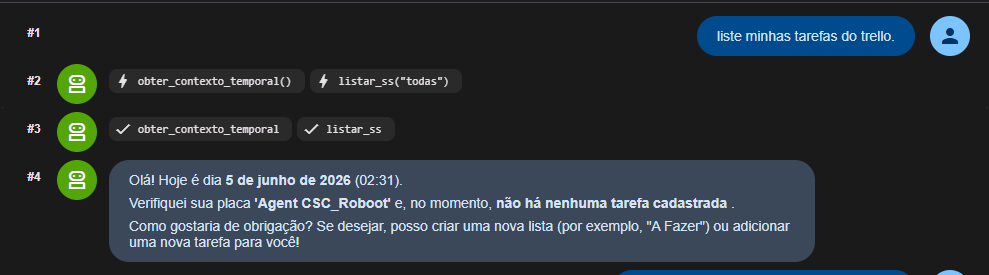


### 2. Criação: Adicionando Novas Tarefas

O usuário adiciona várias tarefas manualmente.

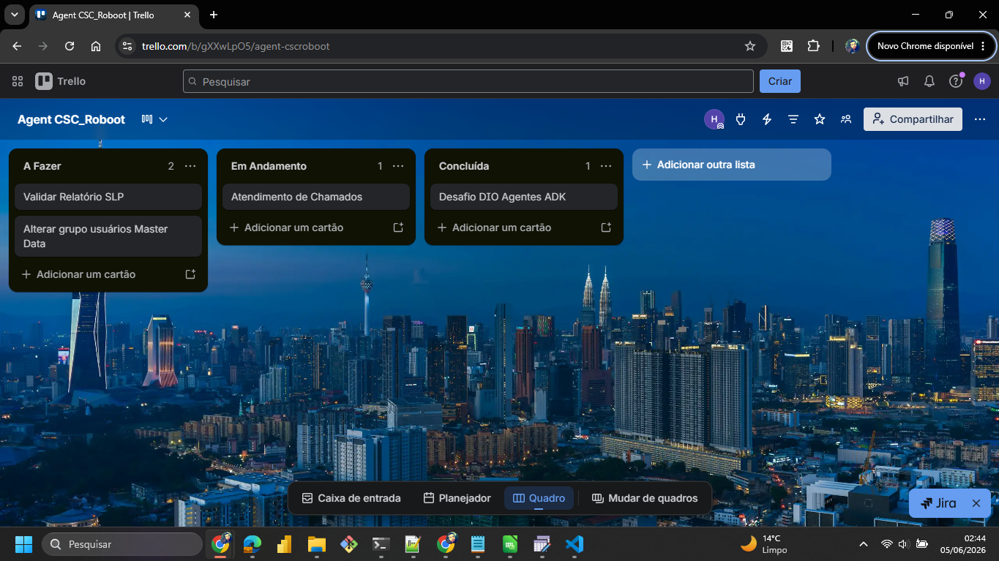

Faz nova pergunta sobre as tarefas e o Agente retorna as tarefas adicionadas manualmente.

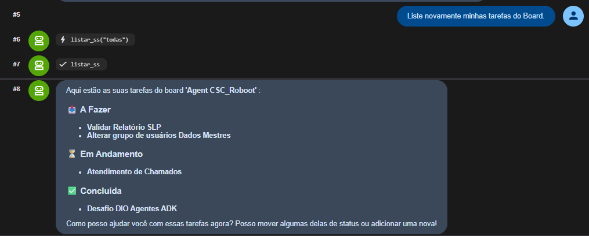


### 3.  Ajuste Fino: Alterando o Prazo de uma Tarefa

O agente também pode ajustar detalhes como datas de vencimento.

**A conversa com o agente:**

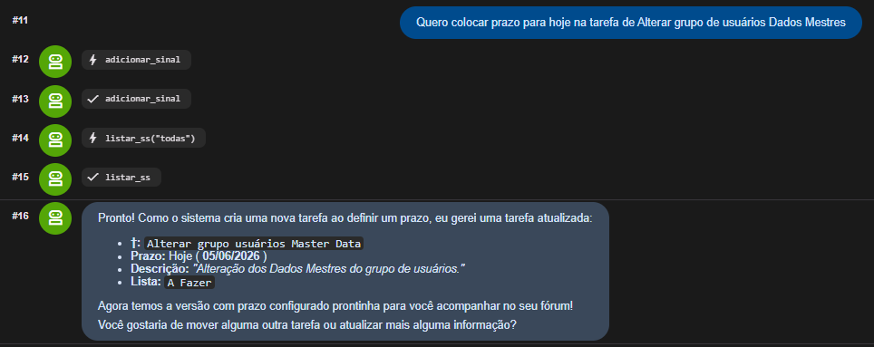


**O resultado no Trello:**

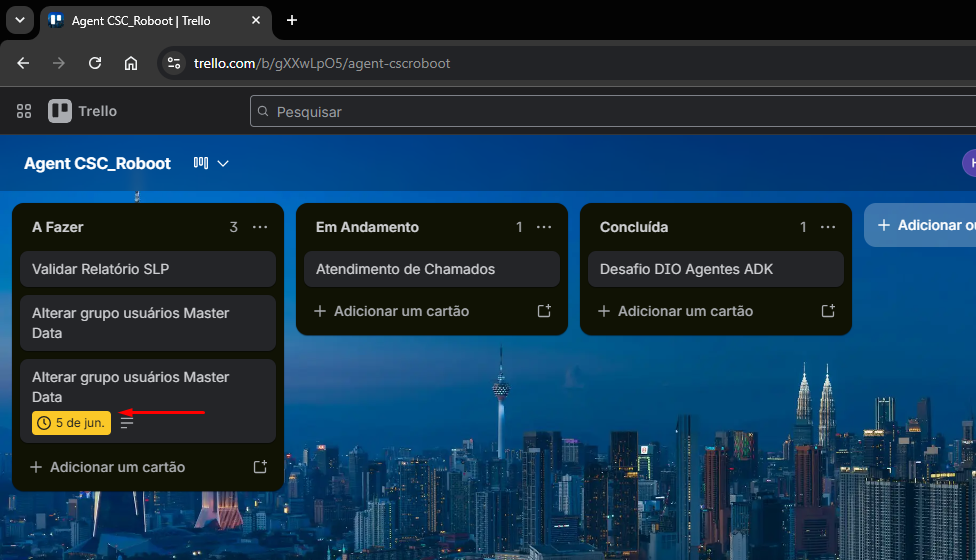


### 4.  Modificação: Alterando o Status de uma Tarefa

Em seguida, o usuário pede para mover uma tarefa para "Em Andamento".

**A conversa com o agente:**

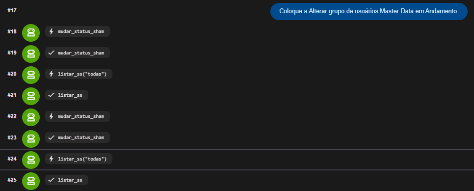


**O resultado no Trello:**

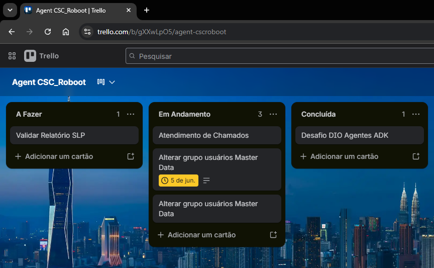

**Resposta do Agente:**

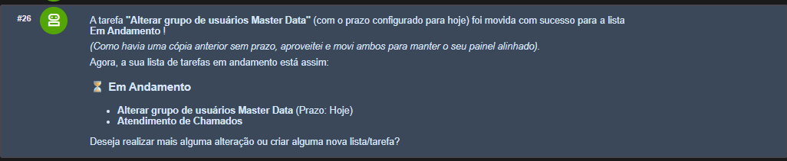


### 5. Remover Tarefas

Tentativa de remover uma tarefa
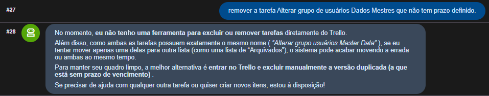


### 6. Criar Tarefas com o Agente 

Criando Tarefa com iteração via agente Trello
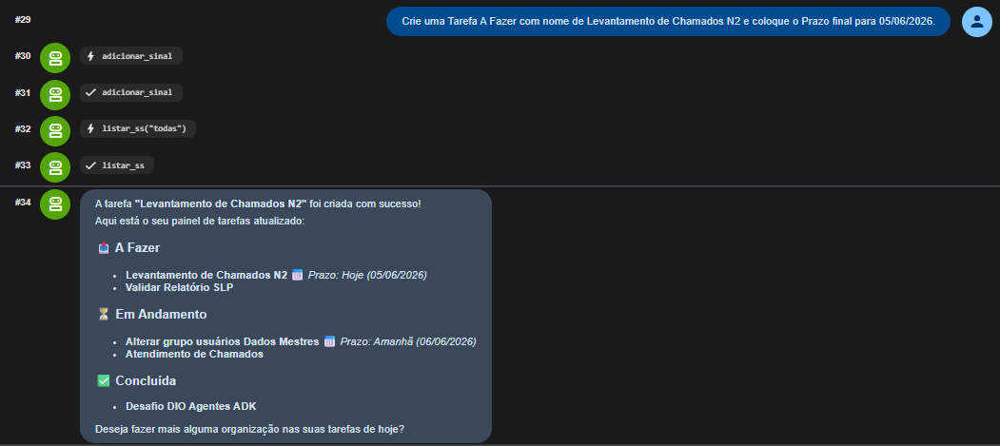

Interface do Trello com a tarefa criada pelo agente com descrição e prazo.

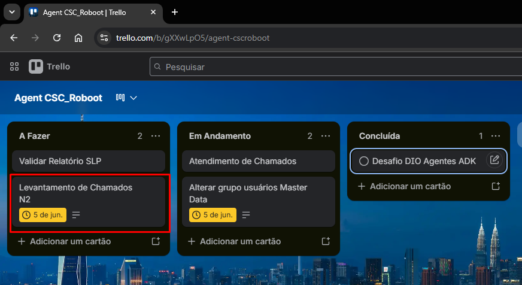

<!--START_SECTION:footer-->
<p align="center">
  <a href="https://www.dio.me/" target="_blank">
    
  </a>
</p>
<!--END_SECTION:footer-->